# Rushdown
Battleships is a strategic, turn-based guessing game in which each user attempts to damage and eventually sink their opponents ships. Battleship actually dates back prior to World War I and was later published by various companies as a pad-and-pencil game in the 1930s. It was then officially released as a plastic board game by Milton Bradley in 1967. 
 - At the start of the game, each user will place their ships on coordinates of their own choosing. There are a total of 100 coordinates/spaces on each user's game board, and each ship can take up anywhere from 2-5 coordinates/spaces on the board.
 - During each turn, the user will decide on coordinates to attack.
 - If the attacked coordinates are empty, the turn is labelled as a "miss". However, if the coordinates are holding a section of their opponent's ship, the turn is labelled as a "hit" and the ship will take damage in that specific coordinate.
 - If all coordinates which house a ship are attacked, that ship is considered to be sunk, and is no longer active in the game.
 - The user also has access to a "hit board" which labels all coordinates which they have attacked and whether they were a "hit" or a "miss".
 - This helps each user to track their shots and make strategic guesses as to where their opponent may be hiding their ships.
 - The first person to successfully sink all their opponents ships is the winner!  
The full **[Battleship](https://conorg180.github.io/battleships/)** game can be played here.  
<!-- Insert image here later -->
## UX design
### Color scheme
The color scheme chosen for this game is based on a simple monochromatic color scheme of black, white and various shades of gold. In the main menu and various game screens, such as instructions and in the game set-up, the game's primary colors remain black white and gold.
- The colors black, white and gold were chosen so as to provide a strong yet majestic feel to the game and convey a pirate-like theme. As the game involved battling ships on the seas, it was thought that this color scheme would achieve the goal of capturing the theme of the game whilst also improving it aesthetically.
- There are multiple shades of Gold which are used throughout the game. This allows for shading and styling throughout each page. An example of this can be seen in the borders of certain elements on each page, such as buttons, and can also be seen in the text area in the action bar when the user attacks a coordinate.
- Furthermore, the game can be easily changed in the future if needed due to the use of CSS root variables in the project. The colors can be seen in the below
#### **Images**
<!-- insert image here -->
## Typography
As with colors, root variables were used to store various fonts and back-up fonts. These can be seen below. 
  - Black Rose was chosen as the main accent font for the project due to it's Stylistic and pirate-like theme. It provided an amazing aesthetical look to the game's logo and also aided in some other parts of the game too. All letters in the Bebas Neue font are capitalised, so whilst great for main headers and logos, a different font was needed for smaller fonts.
  - Treasure Hunt was chosen as the game's secondary accent font and can be seen in smaller headers and on buttons. Treasure hunt was chosen as a secondary acent font as it is slightly easier to read than black rose, albeit swapping some style and "flare" for clarity. Similar to Black Rose, it only allows for capital letters, so another font was still required for text and paragraphs.
#### **Images**
<!-- Insert image here --> 
### Layout
Grid is the primary CSS function used in building the layout to this game, and it was chosen for multiple reasons:
 - With Grid, elements within the game can very easily be manipulated, hidden, unhidden, swapped, replaced or repositioned in the future if needed.
 - Grid allows a developer to create highly responsive designs with great flexibility. Responsiveness is one of this game's top priorities, and it is designed to be played on various screen sizes from a minimum of 350px. Elements can be programmed to scale down to a minimum and maximum size, and can then easily be changed as needed when using media queries.
 - One of the easiest and most elegant methods to recreate the typical grid used for battleships was to replicate it with CSS grid, as it's functionality is perfect for creating such grids.
## Wireframes
Before starting development on the project, Balsamiq was used to form wireframes for each separate page within the game. Basamiq was chosen due to it's efficiency and it's ability to reproduce relatively simplistic, yet easy to understand wireframes. This helped me to visualise ideas for each of the game's pages and features, and organise how certain features would be laid out and implemented within the game.  
")

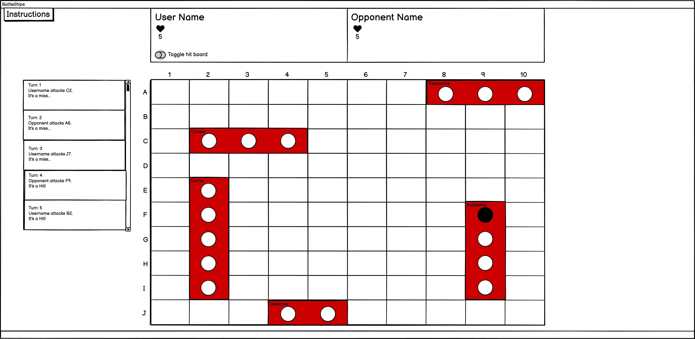
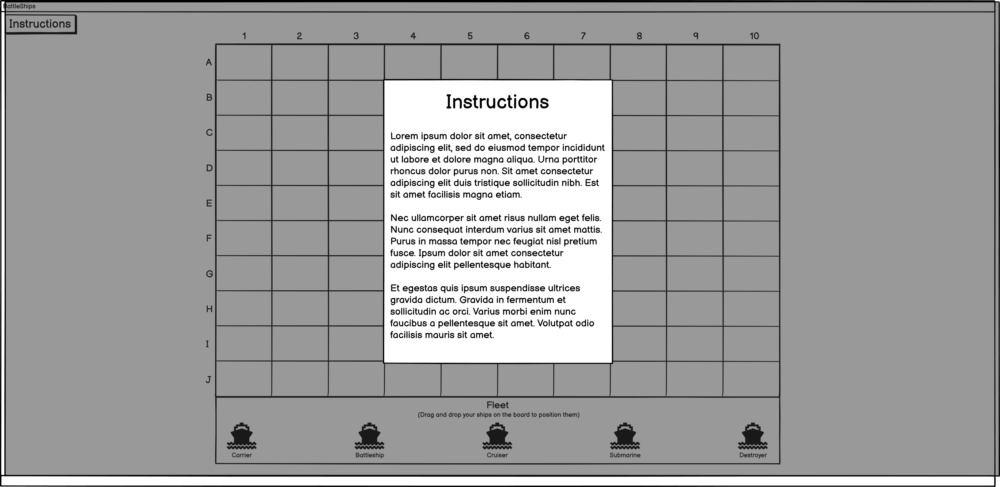
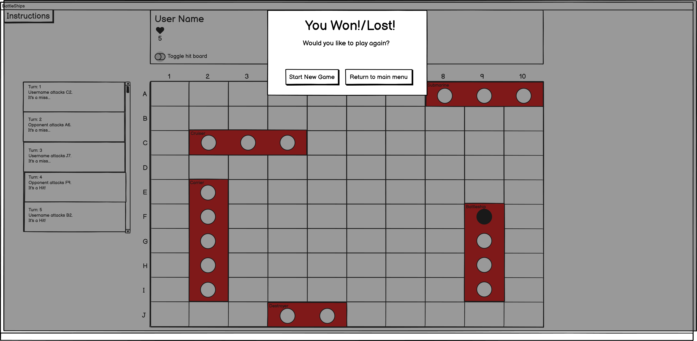

# Features
## Existing features
### Main menu
The Main menu of the game is the first screen that the user should see when the game is loaded. It is designed to be eyecatching and aesthetic, yet not over the top. It should also provide the user an easy route to the game with little difficulty and distractions. Within the main menu, there are 2 buttons
 - Start game button, which triggers the game start-up/options menu to appear.
 - An instructions button, which activates a pop up screen/modal of the game's instructions and how to play the game. 
  #### **Images**  
  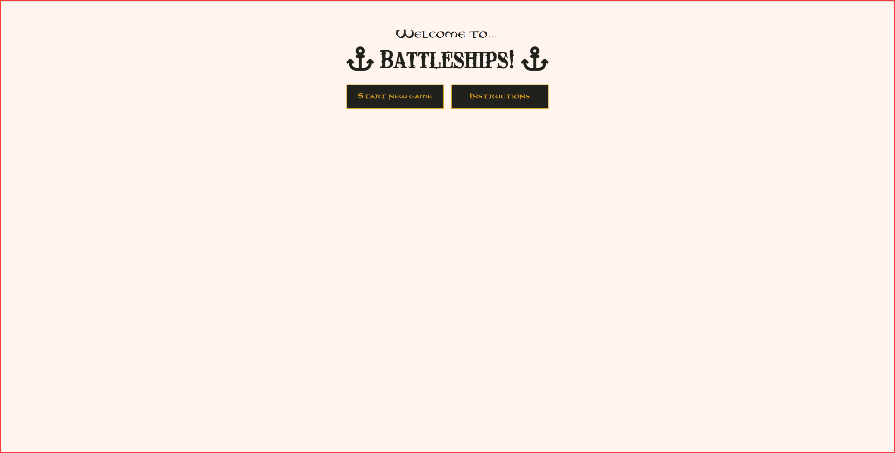
### Game options menu
The Game options menu of the game is the screen which triggers once the user clicks "Begin new game" on the main menu. This screen allows the user to customise the game to their liking, and includes features such as:
  - Entering their name - This value will be used as the game goes on to refer to the player, and will be used in features such as the user's action bar.
  - A difficulty setting - This setting will allow the user to determine at which difficulty they would like to play at. Naturally, a player who is unsure of the game and who is just beginning to learn can set the game to be "easy", if they please. However, medium and hard mode (Especially hard mode) should provide more of a challenge for those who are looking for it
    - Easy - The logic of the Easy mode is as follows: On the opponent's turn, the opponent will randomly pick one coordinate out of a possible 100, and attack the coordinate
    - Medium - The logic of the Medium mode is as follows: On the opponent's turn, the opponent will randomly pick one coordinate out of a possible 100, and attack the coordinate. The opponent will then remove that coordinate from their attackChoices property, and on the next turn, will pick one possible coordinate out of 99. This ensures the opponent never hits the same coordinate twice, as opposed to easy mode.
    - Hard - The logic of the Hard mode is as follows: On the opponent's turn, the opponent will act the same as if the setting was set to Medium difficulty. However, a missCounter variable is used to count the number of times the opponent consecutively misses. Should the opponent miss 3 times in a row, the opponent will guarentee a hit against the user on the 4th turn. If the opponent hit's a ship, the missCounter is reset to 0.
  #### **Images**  
  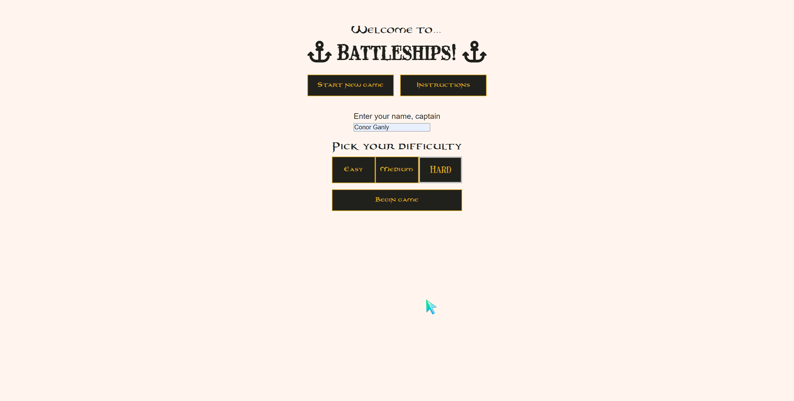
  ### Game Screen
  The Game screen is the main screen which the user plays the battleships game, and naturally has the most features. The gameScreen itself is built using grid and has been designed to be fully responsive down to a 350px screen. Subfeatures included on the Game screen include:
    - Header - The header includes the battleships title, and also includes an instructions button and main menu button
      - Instructions button - The instructions button will trigger a modal to pop up, outlining the instructions of the game.
      - Main menu button - The main menu button will trigger a reload of the page, and by doing so, navigate the user back to the main menu.
    - Action bar - the Action bar holds all relevant information that the user will want to see during the game, including the number of ships that they and their opponent have left, and the user's score.
      - Score - The score on the action bar represents how well the player is doing. Points are score when the user hits or sinks a ship, and a score multiplier is included to increase the score even further when consecutive hits have been made. However, points can be lost for missed, and also if the opponent hits or sinks the user's ships 
      - Ships remaining - The ships remaining part of the action bar displays how many ships/lives the user or opponent has left. Once this reaches 0, the game will be finished, and the user will be declared to have won or lost.
      - Text area - The text area is where the user can find out and retrace their previous coordinate attacks. The text-area will display a different style for the user's attacks, and will declare the coordinate attacked, if the attack made by the user or opponent was a hit or miss, and whether they have sunk a ship.
    - Game board - The Game board is the actual grid where the user will place their ships. Each coordinate responds in various ways when a ship enters, leaves, or is dropped on to it.
     - Once the ship is dropped into a coordinate, the ship will grow to it's corresponding size. For example, if a ship has a size of 5, like the carrier, it will cover 5 coordinates in it's length.
      - Once  dropped on to a coordinate, the ship will automatically be assigned a hitbox in accordance to the coordinate it was placed on and the coordinates which it occupies.
      - Rotation - Ships can be rotated in the game whilst on the grid. This will also change the ship's hitbox accordingly, so that it's coordinates will be correct when the game begins.
      - Once a ship is dragged into a coordinate, the group of coordinates will be highlighted, to let the user know where the ship will be. (It is important to place the ship in it's first coordinate. The gameboard will not automatically do this. This may be something to add to the project in the future).
      - Ships can be redragged on to different coordinates.
      - Auto Resize - The grid will be auto resized when a window is made smaller, and grid coordinates will remain square rather than rectangular.
      - The grid will automatically check if a coordinate is occupied. A coordinate is considered occupied if a ship tries to take coordinates which another ship is currently taking up, or if the requested coordinates are off the grid (E.g. a ship going from A9 - A12. A12 doesn't exist).
    - Fleet - The fleet includes each ship which the user has access to and each ship's name. Each ship can be placed on the grid by simply dragging the ship on to the grid and dropping the start of the ship into a coordinate. Ships can also be rotated.
      - Each ship can be rotated by right clicking on the ship. This will set a property called "rotation" on the ship from false to true, and the ship will rotate and be vertical
      - Each ship can be dragged on to the grid from the fleet by simply holding down the left mouse button, dragging the ship on to the grid, and then releasing the mouse button on the first coordinate which you want the ship to be on.
      - Auto resize - The fleet has an autoResize feature which will trigger once a window is resized. This ensures ships are kept to the appropriate height/width and aids in making the application responsive. 
      - Once the last ship has been placed from the fleet, A modal will be triggered which asks the user if they wish to start the game.
  #### **Images**  
  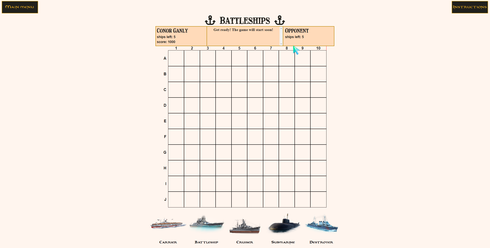
  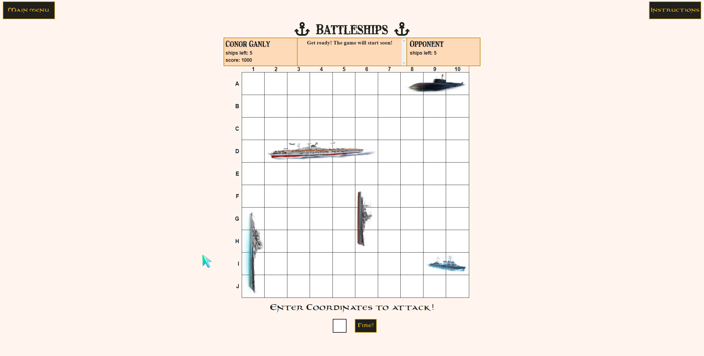
  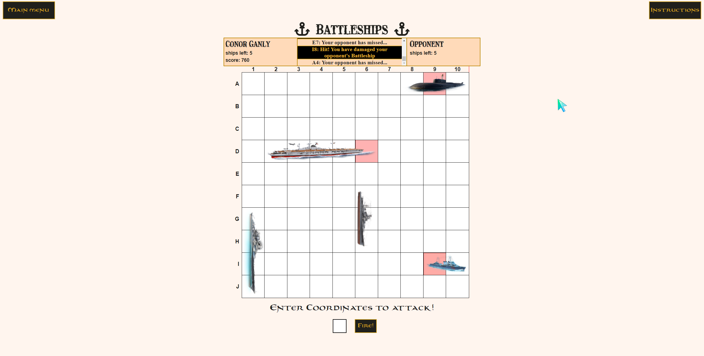
  ### Game begin screen
  The Game begin screen is actually a modal which will pop up when the user has placed their last ship. It will ask the user to confirm if they would like to begin the game. The user can click yes, which will officially start the game, or no, which will move the last placed ship back to the fleet and allow the user to reposition their ships if wanted.
    - If the user clicks yes, then the gameSetUp function will be called, which will officially start the game and populate the opponent's fleet
    - If the user clicks no, then the last ship that the user placed will be returned to the fleet. The user will then have the choice of rearranging any of their ships. Once the user has dragged their last ship from the fleet which was previously returned, the modal will pop up again, asking the user if they are ready to continue and start the game.
  #### **Images** 
  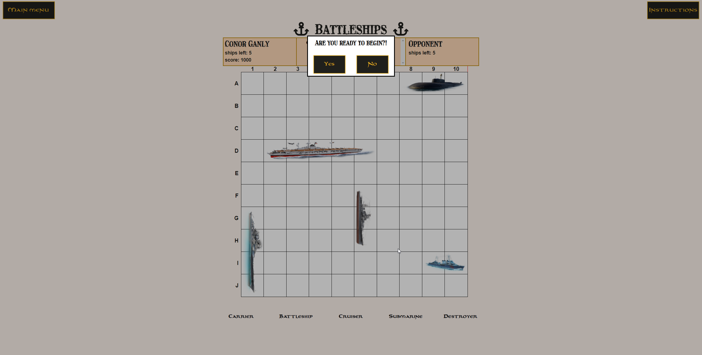
  ### User coordinate input
  The user coordinate input is where the user will type in coordinates to attack the opponent's ships, and it can be seen in the above photos in the game screen images section here <!--Add link here --> The input takes the coordinates and checks them against the opponent's ships.
    - Depending on whether the user has hit, sunk or missed a ship, it will affect the score of the user along with the text area and the ships remaining number in the action bar. This in turn will affect if the game should be terminated (If the number of ships reaches 0).
    - The input is set to automatically clear once the "fire" button has been pressed. This allows the user to enter the next coordinate straight away, without first deleting the previous coordinate.
    - The input entered by the user will be in the Black Rose font, which is the primary accent font used for the game. This is meant to add another, albeit small, element of immersion to the game.
    - Once the "fire" button has been pressed, the input of the coordinate will automatically be checked by a game property called coordinateRegex in the game object to see if it was wrongly entered. If so, the user will be given an alert asking them to "Please enter a valid coordinate".
  ### Game verdict modal
  The game verdict modal will fire once either the opponent's or user's ships remaining element hits zero. Depending on if it was the user or the opponent's ships which reached zero first, a different message will be produced with different colors.
    - The winning message will congratulate the user on winning and display a "You've won!" message in a green color.
    - The losing message will inform the user They have lost and display a "You've lost!" message in a red color.
    - Both messages will offer the player to either play the game (This is done using the game.resetGame function) or to return to the main menu.
  #### **Images** 
  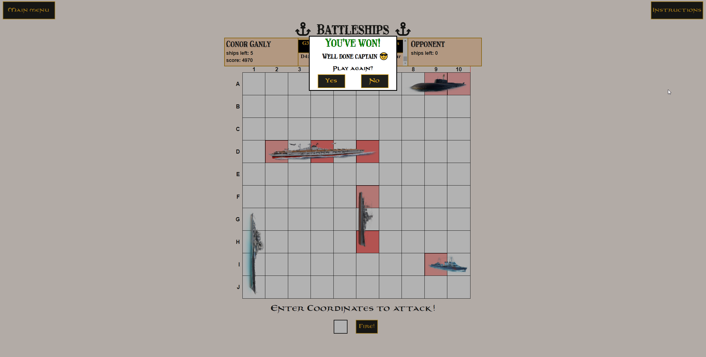
  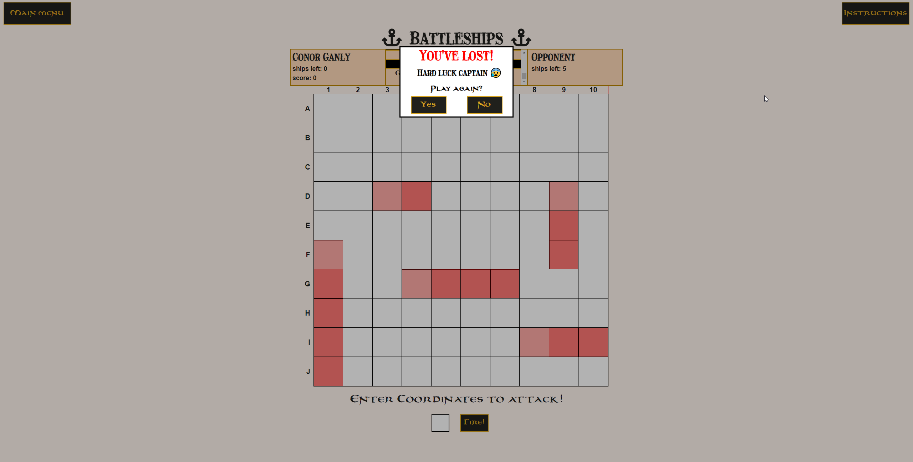
  ## Future features
  The following features are ideas which may be later added into the programme.
    - A hitboard - A hitboard which the user could look at to gain a visual representation of which coordinates they have entered, and which ones were a miss or hit.
    - Click to enter coordinates - Event listeners may be added to the coordinates in the future to respond to click events by the user once the game is active. These listeners would allow the user to enter the coordinate they want to attack by clicking the coordinate, as opposed to entering it manually.
    - Color customisation - This feature would allow users to customise the game's game board to their own color, along with the fleet and the action bar
    - Sound effects and animations - In the future, I believe a great addition to this programme would be to animate the ships once a ship has been sunk or hit, along with relevant sounds to accompany the animation effects.
    ## Technologies used
    The following technologies were used in the development of this project
      - [HTML5](https://developer.mozilla.org/en-US/docs/Web/HTML) - HTML5 was used to apply the structure and to create the elements within the battleships game.
      - [CSS](https://developer.mozilla.org/en-US/docs/Web/CSS) - CSS was used to style each element in the game and controls the layout, color scheme, and some aspects of image and element resizing to improve the programmes responsiveness on smaller devices.
      - [Javascript](https://www.javascript.com/) - Javascript was used to add interactivity throughout the game and is responsible for handling the logic of the game's mechanics, including elements such as modals, score counting, dragging and dropping ships, and also aids in resizing some elements along with css to aid in the responsiveness of the game. No libraries or frameworks were used within Javascript.
      - [Balsamiq](https://balsamiq.com/) - Balsamiq was used to create wireframes at the beginning of the project and aided in visualising ideas and features of the battleships programme.
      - [Git](https://git-scm.com/) - Git was used for version control throughout this project.
      - [Gitpod](https://www.gitpod.io/) - Gitpod was used as the integrated developement environment for the game and to deploy the game.
      - [Github](https://github.com/) - Github was used to host the project through Github pages.
    ## Deployment
  The game was deployed to GitHub pages. The steps to deploy are as follows: 
    - In the [GitHub repository](https://github.com/ConorG180/battleships), navigate to the Settings tab 
    - From the source section drop-down menu, select the **Main** Branch, then click "Save".
    - The page will be automatically refreshed with a detailed ribbon display to indicate the successful deployment.  
    The live link can be found [here](https://conorg180.github.io/battleships/)
    ### Local Deployment
    In order to make a local copy of this project, you can clone it. In your IDE Terminal, type the following command to clone my repository:
    - `git clone https://github.com/ConorG180/battleships.git`
    Alternatively, if using Gitpod, you can click below to create your own workspace using this repository.  
      
  ## Credits
  ### Content
  The sources below were used when trying to solve intricate problems within the programme and played a solid role in helping me to build this project.
  - [W3schools](https://www.w3schools.com/) was used as a learning resource and helped me with HTML, CSS and Javascript.
  - Kevin Powell's [Youtube channel](https://www.youtube.com/kepowob) was used as a learning resource and helped me greatly with HTML and CSS.
  - Web Dev Simplified's [Youtube channel](https://www.youtube.com/c/WebDevSimplified) helped me immensely with Javascript.
  - Dcode's [Youtube Channel](https://www.youtube.com/c/dcode-software) was also a great resource to use when learning about intricate Javascript methods.
  - [Stack Overflow](https://stackoverflow.com/) was used as a learning resource and helped me with any questions I had whilst building the project.
  - [Balsamiq](https://balsamiq.com/) helped me to design the wireframes for the project.
  - [Fontspace](https://www.fontspace.com/) supplied the Black Rose and Treasuremap fonts found in the game.
  - [Font Awesome](https://fontawesome.com/) supplied the icons used throughout the game.
  ### Media
  All images for the ships in this project came from the following sources:
  - The Carrier ship came from [Cobishop](https://www.cobishop.cz/product-en/cobi-building-blocks/world-war-ii/german-aircraft-carrier-graf-zeppelin-co/746).
  - The Battleship ship came from [World of Warships:](https://world-of-warships.fandom.com/wiki/Battleship).
  - The Cruiser ship came from [World of Warships:](https://worldofwarships.eu/en/news/history/a-look-through-time-pan-asian-cruisers/).
  - The Submarine ship came from [Megapolis](https://sqmegapolis.fandom.com/wiki/Submarine_Factory).
  - The Destroyer ship came from [World of Warships:](https://www.wowsbuilds.com/ships/siroco).

  ### Acknowledgements
  I want to thank the following people and companies for their help in providing solid technical support whilst developing this project.
  - Tim Nelson (Code Institute mentor).
  - [Code Institute](https://codeinstitute.net/ie/).