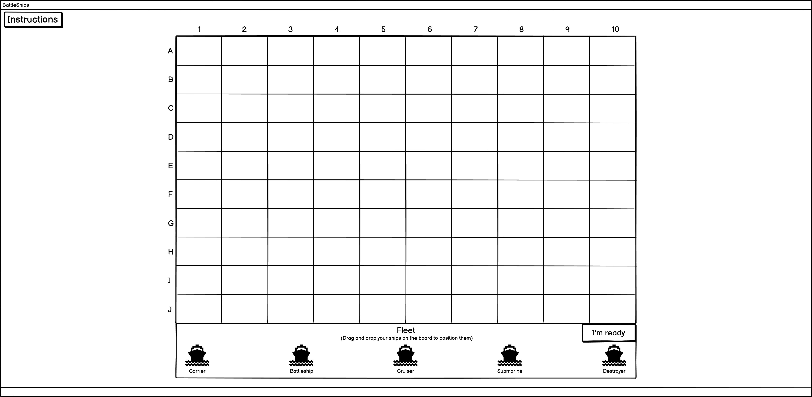

# Rushdown
Battleships is a strategic, turn-based guessing game in which each user attempts to damage and eventually sink their opponents ships. Battleship actually dates back prior to World War I and was later published by various companies as a pad-and-pencil game in the 1930s. It was then officially released as a plastic board game by Milton Bradley in 1967. 
 - At the start of the game, each user will place their ships on coordinates of their own choosing. There are a total of 100 coordinates/spaces on each user's game board, and each ship can take up anywhere from 2-5 coordinates/spaces on the board.
 - During each turn, the user will decide on coordinates to attack.
 - If the attacked coordinates are empty, the turn is labelled as a "miss". However, if the coordinates are holding a section of their opponent's ship, the turn is labelled as a "hit" and the ship will take damage in that specific coordinate.
 - If all coordinates which house a ship are attacked, that ship is considered to be sunk, and is no longer active in the game.
 - The user also has access to a "hit board" which labels all coordinates which they have attacked and whether they were a "hit" or a "miss".
 - This helps each user to track their shots and make strategic guesses as to where their opponent may be hiding their ships.
 - The first person to successfully sink all their opponents ships is the winner!  
The full **[Battleship](https://conorg180.github.io/rushdown-mma-gym/index.html)** game can be played here.  
<!-- Insert image here later -->

## Wireframes
Before starting development on the project, Balsamiq was used to form wireframes for each separate page within the game. Basamiq was chosen due to it's efficiency and it's ability to reproduce relatively simplistic, yet easy to understand wireframes. This helped me to visualise ideas for each of the game's pages and features, and organise how certain features would be laid out and implemented within the game.  

# Features
## Existing features

### Main menu
The Main menu of the game is the first screen that the user should see when the game is loaded. It is designed to be eyecatching and aesthetic, yet not over the top. It should also provide the user an easy route to the game with little difficulty and distractions. Within the main menu, there are 2 buttons
 - Start game button, which triggers the game start-up/options menu to appear.
 - An instructions button, which activates a pop up screen/modal of the game's instructions and how to play the game. 
  #### **Images**  
    <!-- Insert image here -->
