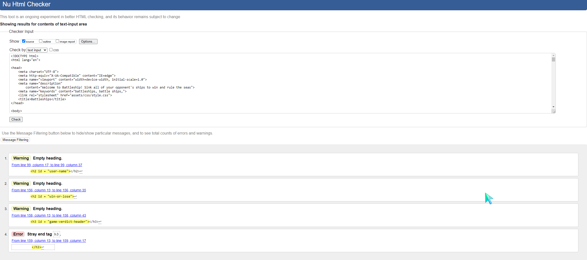
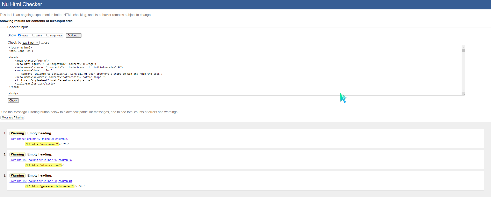

# Testing
## Browser Compatability
Testing of the website was carried out in Firefox, Microsoft Edge, Opera and Google Chrome. When testing on Firefox, a bug was discovered which would activate a ship's image link when dropping the ship into a coordinate. Because of this, ```e.preventDefault()``` was used in the drop event handler to fix the issue.
Apart from this,The game seemed to work without any specific issues on a browser. The identified bugs within the project are still found in all browsers though, as they are not browser specific.
It should be noted that CSS grid and some other functions/properties may not be supported on older versions of the above browsers. For an optimum experience with the game, users are reccommended to update to the latest version of their preferred browser.
## Testing and identified bugs
The following tools and technologies were used to test this project:
### **W3C html validator**
 W3C html validator was used on the sole HTML document, index.html, within the project to confirm that there were no errors made in the code. Whilst testing, there was a minor bug found on the page. This bug was caused by a stray h3 tag. However, the bug was easily fixed, and after retesting, no errors were found.  
 There were some warnings found in the index.html document, however these are only warnings rather than errors, and do not pose a risk. All warnings came in the form of an empty h2 or h3 tag. These tags are later filled with text content via Javascript code as the user progresses through the game.
#### **Images**  
  
  