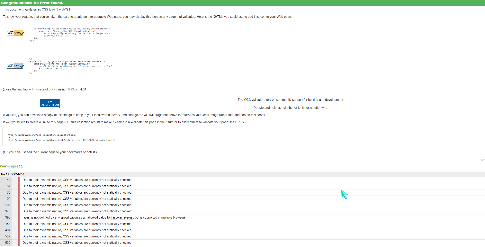
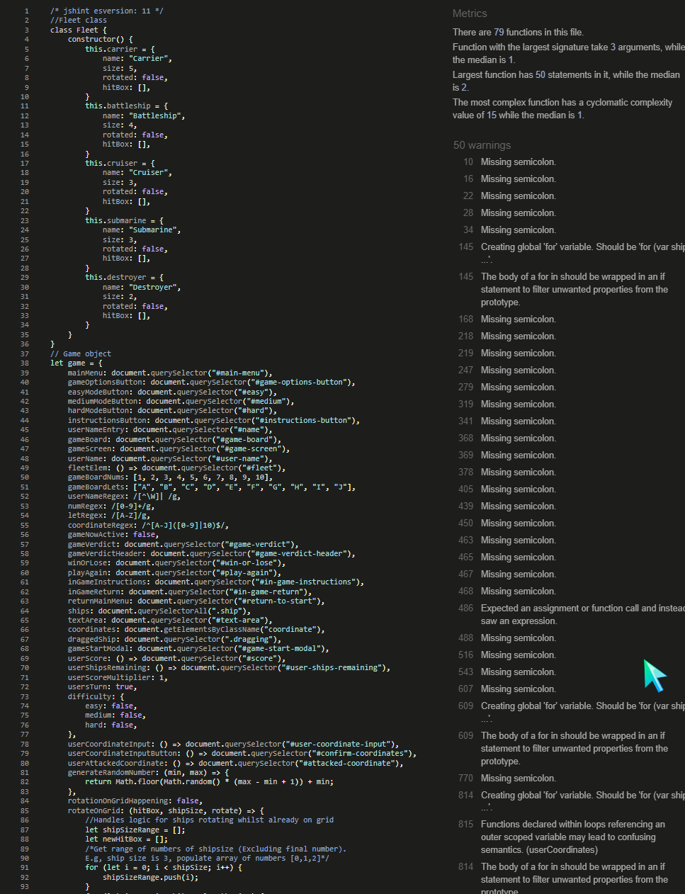
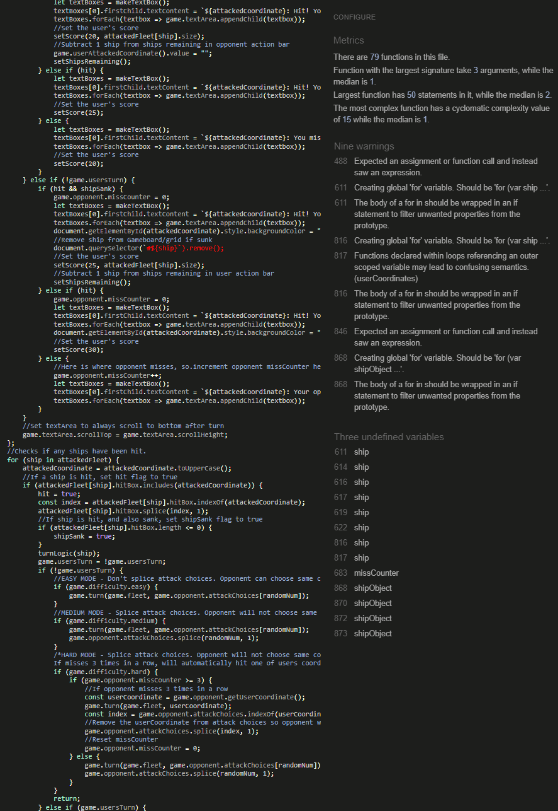
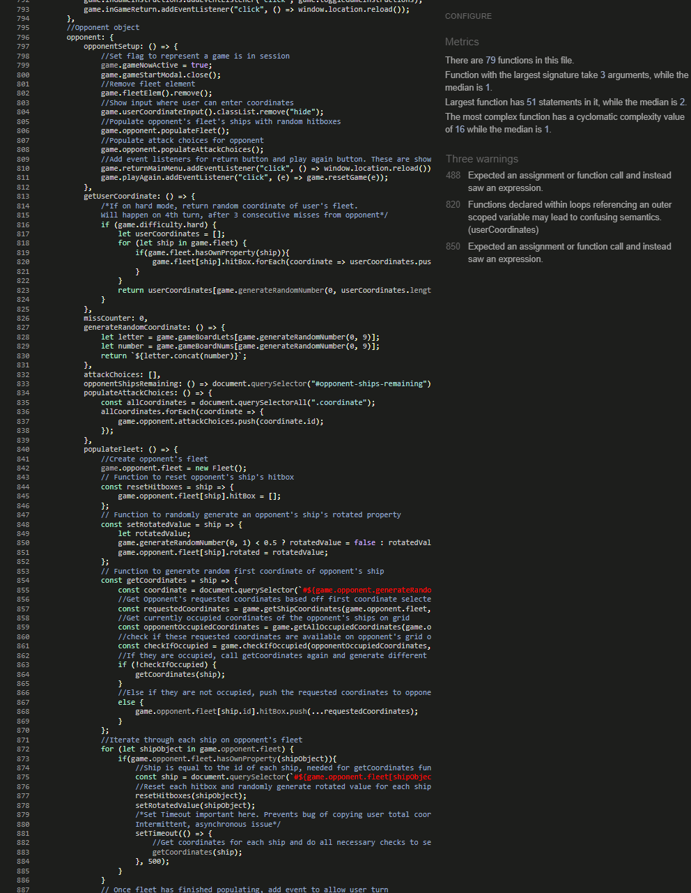

- [Testing](#testing)
- [Browser Compatability](#browser-compatability)
- [Testing and identified bugs](#testing-and-identified-bugs)
  - [**W3C html validator**](#w3c-html-validator)
    - [**Images**](#images)
  - [**W3C CSS validator**](#w3c-css-validator)
    - [**Images**](#images-1)
  - [**Jshint Javascript validator**](#jshint-javascript-validator)
    - [**Images**](#images-2)
- [Responsiveness](#responsiveness)
  - [**Amiresponsive**](#amiresponsive)
    - [**Images**](#images-3)
- [Unfixed Bugs](#unfixed-bugs)
# Testing
# Browser Compatability
Testing of the website was carried out in Firefox, Microsoft Edge, Opera and Google Chrome. When testing on Firefox, a bug was discovered which would activate a ship's image link when dropping the ship into a coordinate. Because of this, ```e.preventDefault()``` was used in the ```drop``` event handler to fix the issue.
Apart from this,The game seemed to work without any specific issues on a browser. The identified bugs within the project are still found in all browsers though, as they are not browser specific.
It should be noted that CSS grid and some other functions/properties may not be supported on older versions of the above browsers. For an optimum experience with the game, users are reccommended to update to the latest version of their preferred browser.
# Testing and identified bugs
The following tools and technologies were used to test this project:
## **W3C html validator**
W3C html validator was used on the sole HTML document, index.html, within the project to confirm that there were no errors made in the code. Whilst testing, there was a minor bug found on the page. This bug was caused by a stray h3 tag. However, the bug was easily fixed, and after retesting, no errors were found.  
There were some warnings found in the index.html document, however these are only warnings rather than errors, and do not pose a risk. All warnings came in the form of an empty h2 or h3 tag. These tags are later filled with text content via Javascript code as the user progresses through the game.
### **Images**  
  
  
## **W3C CSS validator**
The W3C CSS validator was used to test the project's style.css document. 
Fortunately, no bugs were found throughout the CSS document, and no changes were made. It should be noted that warnings were discovered through the testing, however the vast majority of these warning were due to the W3C CSS validator lacking the ability to check root variables, due to their dynamic nature. Another warning showed which mentioned that "```auto``` is not defined by any specification as an allowed value for ```pointer-events``` but is supported in multiple browsers".
### **Images**
  
## **Jshint Javascript validator**
The Jshint Javascript validator was used to test the project's battleships.js document. The Jshint validator originally flagged zero errors and fifty warnings, however, the vast majority of these were forgotten semi colons. Once the semi colons were put into place, there was a total of nine warnings remaining.  
Out of these nine warnings, a total of six could be prevented by simply:
  - When looping through an object's properties, use an ```if``` statement to check to see if the object has the property. This can be done with the ```.hasOwnProperty()``` method.
  - Creating local variables by using either ```const``` or ```let```.  
After fixing these six warnings, three warnings still remained but ultimately caused no problems within the programme. These three warnings were caused by:
  - Using an expression to test if a statement is ```true```, and then using that ```true```/```false``` stateement to control another variable/property rather than the expression itself.
  - Targeting a variable outside the scope of a ```for``` loop with a function.
It is important to note that these are warnings rather than errors, and do not seem to cause any issues whilst the programme is active.
### **Images**



# Responsiveness
## **Amiresponsive**
Amiresponsive is a website which was used to test how the website will appear across different devices.
- Whilst testing with Amiresponsive, the game seemed to show up fine and was not causing any overlap on any of the devices. There was however a small issue of a horizontal scrollbar when the game was displayed on the Amiresponsive phone. This is strange, as the game is responsive down to 350 pixels. Despite this, no major issues were found in terms of responsiveness, such as overlapping elements, elements bleeding off screen etc.
### **Images**

# Unfixed Bugs
There is unfortunately one unfixed bug in the project which can sometimes happen when a ship has been dropped on to a coordinate, then moved, then replaced by another ship (Or the same ship) in a different rotation. This will not cause the game to break, but will cause the ship image to stretch out
**To fix this, simply rotate the ship twice.** Once to move it to it's opposite rotation position, and again to move it back to the preferred position.